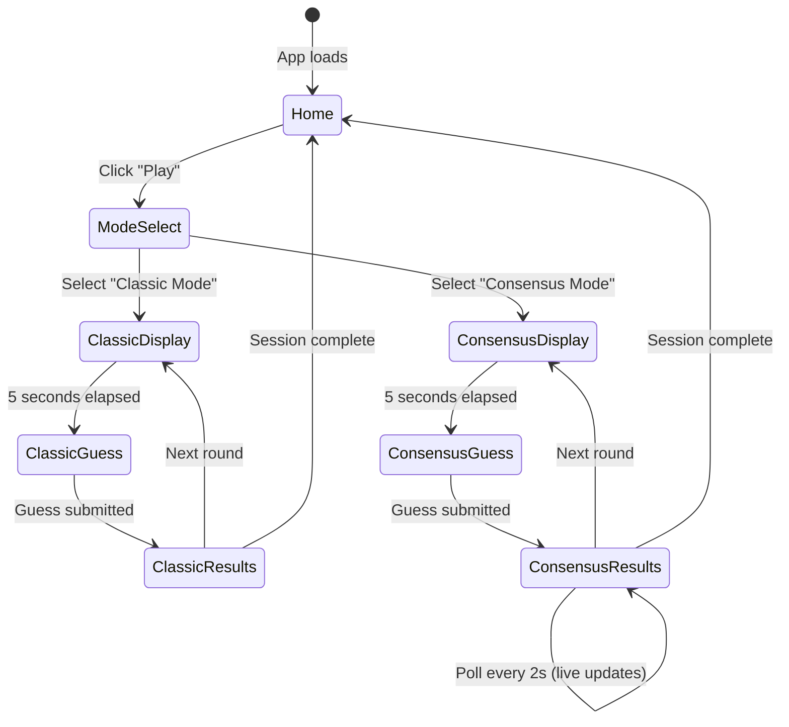

# Design Document

## Overview

Consensus Voting Phase 2 transforms Geometric Pictionary into a crowd-sourced guessing game where players earn points based on matching popular opinion rather than a pre-defined answer. Inspired by r/place's voting visualization, this phase aggregates all player guesses in real-time and displays them as a live poll with percentage bars, creating emergent "correct" answers determined by the community.

The architecture extends the existing Phase 1 implementation by adding Redis-based guess aggregation, a new poll-style results display component, consensus-based scoring algorithms, and real-time polling for live updates. The system handles multiple concurrent players contributing to the same prompt session, with efficient Redis operations to prevent performance bottlenecks.

## Architecture

### High-Level Architecture Extension

```
┌─────────────────────────────────────────────────────────────┐
│                        Reddit Platform                       │
│  ┌───────────────────────────────────────────────────────┐  │
│  │                    Devvit Post                        │  │
│  │  ┌─────────────────────────────────────────────────┐ │  │
│  │  │          React Client (Browser)                 │ │  │
│  │  │  - Phase 1 Components (existing)                │ │  │
│  │  │  - NEW: PollResultsDisplay                      │ │  │
│  │  │  - NEW: ConsensusScoreDisplay                   │ │  │
│  │  │  - NEW: Real-time polling hook                  │ │  │
│  │  └─────────────────┬───────────────────────────────┘ │  │
│  │                    │ HTTP (fetch /api/*)             │  │
│  │  ┌─────────────────▼───────────────────────────────┐ │  │
│  │  │          Express Server (Serverless)            │ │  │
│  │  │  - Phase 1 Routes (existing)                    │ │  │
│  │  │  - NEW: /api/consensus/submit-guess             │ │  │
│  │  │  - NEW: /api/consensus/get-results              │ │  │
│  │  │  - NEW: Guess aggregation logic                 │ │  │
│  │  │  - NEW: Consensus scoring algorithm             │ │  │
│  │  └─────────────────┬───────────────────────────────┘ │  │
│  │                    │                                  │  │
│  │  ┌─────────────────▼───────────────────────────────┐ │  │
│  │  │          Redis (Devvit)                         │ │  │
│  │  │  - Phase 1 Data (existing)                      │ │  │
│  │  │  - NEW: prompt:{id}:guesses (Hash)              │ │  │
│  │  │  - NEW: prompt:{id}:players (Set)               │ │  │
│  │  │  - NEW: prompt:{id}:player:{user}:guess (String)│ │  │
│  │  └─────────────────────────────────────────────────┘ │  │
│  └───────────────────────────────────────────────────────┘  │
└─────────────────────────────────────────────────────────────┘
```

### Technology Stack (Extends Phase 1)

- **Frontend**: React 19.1.0 with TypeScript (existing)
- **State Management**: React useReducer + new useConsensusPolling hook
- **Styling**: Tailwind CSS 4.1.6 (existing)
- **Backend**: Express 5.1.0 (existing)
- **Data Storage**: Redis with new aggregation schema
- **Build Tool**: Vite 6.2.4 (existing)
- **Platform**: Devvit Web 0.12.1 (existing)

## Components and Interfaces

### New Client Components

#### 1. PollResultsDisplay.tsx

- **Purpose**: Display aggregated guesses as a poll with percentage bars (replaces ResultsDisplay in consensus mode)
- **Responsibilities**:
  - Fetch and display top 10 guesses sorted by popularity
  - Render horizontal percentage bars proportional to vote counts
  - Highlight player's guess with distinct styling
  - Mark creator's intended answer with special indicator (gold border/star)
  - Show total players and total guesses at bottom
  - Poll server every 2 seconds for live updates
  - Animate changes when rankings shift
- **Props**:
  ```typescript
  type PollResultsDisplayProps = {
    promptId: number;
    playerGuess: string | null;
    creatorAnswer: string;
    timeRemaining: number;
    onComplete: () => void;
  };
  ```

#### 2. ConsensusScoreDisplay.tsx

- **Purpose**: Show consensus-based score breakdown and matching percentage
- **Responsibilities**:
  - Display points earned based on consensus tier (100/50/25/10/0)
  - Show message like "You matched 85% of players!"
  - Animate score reveal with count-up effect
  - Display tier badge (Majority/Common/Uncommon/Rare/Unique)
- **Props**:
  ```typescript
  type ConsensusScoreDisplayProps = {
    pointsEarned: number;
    matchPercentage: number;
    tier: 'majority' | 'common' | 'uncommon' | 'rare' | 'unique';
    totalScore: number;
  };
  ```

#### 3. GuessAggregationBar.tsx

- **Purpose**: Reusable component for individual guess bar in poll display
- **Responsibilities**:
  - Render guess text, count, and percentage
  - Display horizontal bar with width proportional to percentage
  - Apply highlighting if it's the player's guess
  - Apply special styling if it's the creator's answer
  - Animate bar width changes
- **Props**:
  ```typescript
  type GuessAggregationBarProps = {
    guess: string;
    count: number;
    percentage: number;
    isPlayerGuess: boolean;
    isCreatorAnswer: boolean;
    rank: number;
  };
  ```

### New Custom Hooks

#### useConsensusPolling.ts

- **Purpose**: Poll server for live aggregation updates during results phase
- **Parameters**:
  - `promptId: number` - Current prompt ID
  - `enabled: boolean` - Whether polling is active
  - `interval: number` - Polling interval in ms (default 2000)
- **Returns**:
  ```typescript
  {
    aggregation: GuessAggregation[] | null;
    totalPlayers: number;
    totalGuesses: number;
    loading: boolean;
    error: string | null;
  }
  ```
- **Logic**:
  - Use setInterval to poll /api/consensus/get-results every 2 seconds
  - Only poll when enabled is true (during results phase)
  - Clean up interval on unmount or when disabled
  - Handle errors gracefully without breaking UI

### New Server API Endpoints

#### POST /api/consensus/submit-guess

- **Purpose**: Submit guess and aggregate with other players' guesses
- **Request Body**:
  ```typescript
  {
    promptId: number;
    guess: string;
    sessionId: string;
  }
  ```
- **Response**:
  ```typescript
  {
    type: 'consensus-guess-submitted';
    success: boolean;
    message: string;
  }
  ```
- **Logic**:
  1. Validate request body (promptId, guess, sessionId)
  2. Get username from Reddit API
  3. Normalize guess (lowercase, trim)
  4. Use HINCRBY to increment count for guess in `prompt:{promptId}:guesses`
  5. Use SADD to add username to `prompt:{promptId}:players`
  6. Store player's specific guess in `prompt:{promptId}:player:{username}:guess`
  7. Set TTL of 24 hours on all keys
  8. Return success response

#### POST /api/consensus/get-results

- **Purpose**: Fetch aggregated guess results for a prompt
- **Request Body**:
  ```typescript
  {
    promptId: number;
    username: string;
  }
  ```
- **Response**:
  ```typescript
  {
    type: 'consensus-results';
    aggregation: GuessAggregation[];
    playerGuess: string | null;
    creatorAnswer: string;
    totalPlayers: number;
    totalGuesses: number;
    playerScore: {
      pointsEarned: number;
      matchPercentage: number;
      tier: 'majority' | 'common' | 'uncommon' | 'rare' | 'unique';
    };
  }
  ```
- **Logic**:
  1. Validate request body (promptId, username)
  2. Use HGETALL to fetch all guesses from `prompt:{promptId}:guesses`
  3. Use SCARD to get total unique players from `prompt:{promptId}:players`
  4. Calculate percentages for each guess
  5. Sort by count descending and take top 10
  6. Fetch player's specific guess from `prompt:{promptId}:player:{username}:guess`
  7. Calculate player's score based on consensus tier
  8. Fetch creator's intended answer from prompts data
  9. Mark which guess is creator's answer
  10. Return aggregated results with player-specific data

## Data Models

### GuessAggregation Type

```typescript
type GuessAggregation = {
  guess: string; // "jellyfish"
  count: number; // 5183
  percentage: number; // 85.2
  isPlayerGuess: boolean; // true if this is the current player's guess
  isCreatorAnswer: boolean; // true if this matches creator's intended answer
  rank: number; // 1-10 position in top guesses
};
```

### ConsensusScoreTier Type

```typescript
type ConsensusScoreTier = 'majority' | 'common' | 'uncommon' | 'rare' | 'unique';

type ConsensusScore = {
  pointsEarned: number; // 100, 50, 25, 10, or 0
  matchPercentage: number; // Percentage of players who guessed the same
  tier: ConsensusScoreTier; // Which tier the guess falls into
};
```

### API Response Types (New)

```typescript
type ConsensusGuessSubmittedResponse = {
  type: 'consensus-guess-submitted';
  success: boolean;
  message: string;
};

type ConsensusResultsResponse = {
  type: 'consensus-results';
  aggregation: GuessAggregation[];
  playerGuess: string | null;
  creatorAnswer: string;
  totalPlayers: number;
  totalGuesses: number;
  playerScore: ConsensusScore;
};
```

### Redis Data Schema (New Keys)

**Prompt Guesses Aggregation**: `prompt:{promptId}:guesses`

- Type: Hash
- Fields: Normalized guess text (e.g., "jellyfish")
- Values: Count of players who guessed it (e.g., "5183")
- TTL: 24 hours

**Prompt Players Set**: `prompt:{promptId}:players`

- Type: Set
- Members: Usernames of players who submitted guesses
- TTL: 24 hours

**Player Specific Guess**: `prompt:{promptId}:player:{username}:guess`

- Type: String
- Value: The player's normalized guess text
- TTL: 24 hours

**Example Redis State**:

```
prompt:42:guesses = {
  "jellyfish": "5183",
  "squid": "193",
  "octopus": "95",
  "house": "47"  // creator's answer, but unpopular
}

prompt:42:players = ["user1", "user2", "user3", ..., "user5518"]

prompt:42:player:user1:guess = "jellyfish"
prompt:42:player:user2:guess = "jellyfish"
prompt:42:player:user3:guess = "squid"
```

## Consensus Scoring Algorithm

### Tier Calculation Logic

```typescript
function calculateConsensusTier(
  playerGuess: string,
  aggregation: GuessAggregation[],
  totalPlayers: number
): ConsensusScore {
  // Find exact match in aggregation
  const match = aggregation.find(
    (agg) => agg.guess.toLowerCase().trim() === playerGuess.toLowerCase().trim()
  );

  if (!match) {
    // Check for close match using Levenshtein distance
    const closeMatch = aggregation.find((agg) => {
      const similarity = calculateSimilarity(playerGuess, agg.guess);
      return similarity >= 70;
    });

    if (closeMatch) {
      return {
        pointsEarned: 5,
        matchPercentage: closeMatch.percentage,
        tier: 'rare',
      };
    }

    // Unique guess (not in top aggregation)
    return {
      pointsEarned: 0,
      matchPercentage: 0,
      tier: 'unique',
    };
  }

  // Calculate tier based on percentage
  const percentage = match.percentage;

  if (percentage >= 50) {
    return {
      pointsEarned: 100,
      matchPercentage: percentage,
      tier: 'majority',
    };
  } else if (percentage >= 20) {
    return {
      pointsEarned: 50,
      matchPercentage: percentage,
      tier: 'common',
    };
  } else if (percentage >= 5) {
    return {
      pointsEarned: 25,
      matchPercentage: percentage,
      tier: 'uncommon',
    };
  } else if (percentage >= 1) {
    return {
      pointsEarned: 10,
      matchPercentage: percentage,
      tier: 'rare',
    };
  } else {
    return {
      pointsEarned: 0,
      matchPercentage: percentage,
      tier: 'unique',
    };
  }
}
```

### Scoring Examples

| Player Guess | Match %              | Tier     | Points | Scenario                              |
| ------------ | -------------------- | -------- | ------ | ------------------------------------- |
| "jellyfish"  | 85%                  | Majority | 100    | Matched the crowd consensus           |
| "squid"      | 35%                  | Common   | 50     | Popular alternative answer            |
| "octopus"    | 12%                  | Uncommon | 25     | Less common but valid                 |
| "cephalopod" | 3%                   | Rare     | 10     | Rare but technically correct          |
| "house"      | 0.8%                 | Unique   | 0      | Creator's answer, but crowd disagreed |
| "jely fish"  | 85% (via similarity) | Rare     | 5      | Close match to "jellyfish"            |

## Game Flow Modifications

### Phase 2 Consensus Mode Flow



### Consensus Mode Timing

**Display Phase (5 seconds)** - Same as Phase 1

1. Fetch next prompt from server
2. Display prompt text
3. Show countdown timer
4. Auto-transition to Guess phase

**Guess Phase (20 seconds)** - Modified

1. Show input field with focus
2. Display countdown timer
3. Accept text input
4. On submit: Call `/api/consensus/submit-guess` (not Phase 1 endpoint)
5. Store guess in Redis aggregation
6. Auto-transition to Results phase

**Results Phase (15 seconds)** - Extended from 10s for live updates

1. Call `/api/consensus/get-results` to fetch aggregation
2. Display PollResultsDisplay component
3. Start polling every 2 seconds for live updates
4. Show animated percentage bars
5. Highlight player's guess and creator's answer
6. Display ConsensusScoreDisplay with tier badge
7. Auto-transition to next Display phase at 0

## UI/UX Design Specifications

### PollResultsDisplay Component Styling

**Layout**:

- Vertical stack of guess bars (top 10)
- Each bar shows: Rank, Guess text, Count, Percentage, Bar visualization
- Full width on mobile, max 800px on desktop
- Centered layout with padding

**Guess Bar Structure**:

```
┌─────────────────────────────────────────────────────────┐
│ #1  jellyfish                    5,183 players    85%   │
│ ████████████████████████████████████████████████░░░░░░  │
└─────────────────────────────────────────────────────────┘
```

**Color Coding**:

- Player's guess: Orange border (2px solid #FF4500)
- Creator's answer: Gold border (2px solid #FFD700) + star icon ⭐
- Majority (≥50%): Green bar (#46D160)
- Common (20-49%): Blue bar (#0079D3)
- Uncommon (5-19%): Yellow bar (#FFB000)
- Rare (<5%): Gray bar (#878A8C)

**Typography**:

- Rank: 1rem, bold, gray
- Guess text: 1.25rem, semibold, dark gray
- Count: 0.875rem, regular, medium gray
- Percentage: 1rem, bold, dark gray
- Pixel font option: "Press Start 2P" or "VT323" for retro Reddit feel

**Animations**:

- Bar width: Animate from 0 to percentage over 500ms (ease-out)
- Rank changes: Slide up/down with 300ms transition
- New entries: Fade in with 200ms
- Percentage updates: Count-up animation over 300ms

**Bottom Summary**:

```
┌─────────────────────────────────────────────────────────┐
│  📊 5,518 players • 6,100 total guesses                 │
│  🎯 You matched 85% of players!                         │
└─────────────────────────────────────────────────────────┘
```

### ConsensusScoreDisplay Component Styling

**Tier Badges**:

- Majority: 🏆 Gold badge, "MAJORITY ANSWER"
- Common: 🥈 Silver badge, "COMMON ANSWER"
- Uncommon: 🥉 Bronze badge, "UNCOMMON ANSWER"
- Rare: 💎 Diamond icon, "RARE ANSWER"
- Unique: ❄️ Snowflake icon, "UNIQUE ANSWER"

**Score Display**:

```
┌─────────────────────────────────────────────────────────┐
│              🏆 MAJORITY ANSWER                         │
│                                                          │
│                  +100 POINTS                            │
│                                                          │
│         You matched 85% of players!                     │
│                                                          │
│            Total Score: 450                             │
└─────────────────────────────────────────────────────────┘
```

**Animation Sequence**:

1. Tier badge fades in (200ms)
2. Points count up from 0 to earned value (500ms)
3. Match percentage fades in (200ms)
4. Total score counts up (300ms)

## Error Handling

### Client-Side Error Handling

1. **Polling Failures**

   - If polling fails 3 consecutive times, stop polling and show cached data
   - Display warning: "Live updates paused - showing last known results"
   - Provide "Retry" button to resume polling

2. **Guess Submission Failures**

   - Retry once automatically with exponential backoff (1s delay)
   - If retry fails, show error: "Failed to submit guess. Your answer was recorded locally."
   - Allow player to continue to results phase with local guess

3. **Empty Aggregation Data**
   - If no guesses are aggregated yet, show: "Be the first to guess!"
   - Display player's guess with 100% until others join
   - Continue polling for updates

### Server-Side Error Handling

1. **Redis Operation Failures**

   - Wrap all Redis operations in try-catch
   - Log errors with context (promptId, username, operation)
   - Return 500 error with message: "Failed to aggregate guesses"
   - Implement fallback: Store guess in memory temporarily

2. **Invalid Prompt ID**

   - Validate promptId exists in prompts array
   - Return 404 error: "Prompt not found"
   - Client should handle by skipping to next prompt

3. **Concurrent Write Conflicts**
   - Use Redis atomic operations (HINCRBY, SADD) to prevent race conditions
   - No explicit locking needed due to atomic operations
   - Log any unexpected Redis errors for debugging
