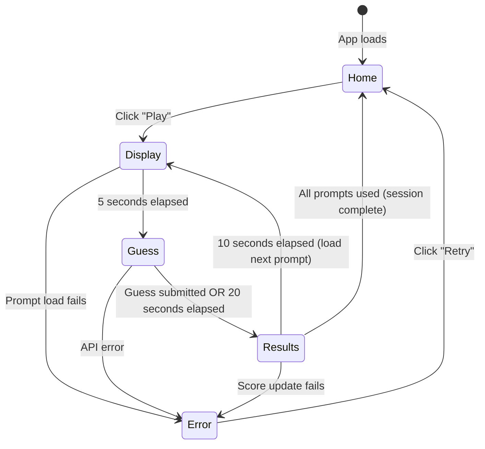

# Design Document

## Overview

Geometric Pictionary Phase 1 is a single-player guessing game built on the Devvit Web platform using React, Express, and Redis. The game presents players with geometric shape descriptions and challenges them to guess what object is being described within a timed session. The architecture follows a client-server pattern where the React frontend handles UI and game flow, while the Express backend manages game state, prompt selection, and scoring via Redis.

This phase focuses on establishing core mechanics: prompt display, timed guessing, scoring, and session management. The design prioritizes mobile responsiveness, smooth phase transitions, and a clean Reddit-inspired aesthetic.

## Architecture

### High-Level Architecture

```
┌─────────────────────────────────────────────────────────────┐
│                        Reddit Platform                       │
│  ┌───────────────────────────────────────────────────────┐  │
│  │                    Devvit Post                        │  │
│  │  ┌─────────────────────────────────────────────────┐ │  │
│  │  │          React Client (Browser)                 │ │  │
│  │  │  - Game UI Components                           │ │  │
│  │  │  - State Management (useReducer)                │ │  │
│  │  │  - Timer Logic                                  │ │  │
│  │  │  - API Calls (fetch)                            │ │  │
│  │  └─────────────────┬───────────────────────────────┘ │  │
│  │                    │ HTTP (fetch /api/*)             │  │
│  │  ┌─────────────────▼───────────────────────────────┐ │  │
│  │  │          Express Server (Serverless)            │ │  │
│  │  │  - API Routes (/api/*)                          │ │  │
│  │  │  - Game Logic                                   │ │  │
│  │  │  - Prompt Management                            │ │  │
│  │  │  - Score Calculation                            │ │  │
│  │  └─────────────────┬───────────────────────────────┘ │  │
│  │                    │                                  │  │
│  │  ┌─────────────────▼───────────────────────────────┐ │  │
│  │  │          Redis (Devvit)                         │ │  │
│  │  │  - Session Scores                               │ │  │
│  │  │  - Used Prompts Tracking                        │ │  │
│  │  └─────────────────────────────────────────────────┘ │  │
│  └───────────────────────────────────────────────────────┘  │
└─────────────────────────────────────────────────────────────┘
```

### Technology Stack

- **Frontend**: React 19.1.0 with TypeScript
- **State Management**: React useReducer for complex game state
- **Styling**: Tailwind CSS 4.1.6
- **Backend**: Express 5.1.0 (serverless)
- **Data Storage**: Redis (via @devvit/web/server)
- **Build Tool**: Vite 6.2.4
- **Platform**: Devvit Web 0.12.1

## Components and Interfaces

### Client Components

#### 1. App.tsx (Main Container)

- **Purpose**: Root component managing overall game state and routing between screens
- **State Management**: Uses useGame hook for centralized game state
- **Responsibilities**:
  - Initialize game session on mount
  - Route between Home, Game, and Results screens
  - Handle global error boundaries
- **Props**: None (root component)

#### 2. HomeScreen.tsx

- **Purpose**: Landing page with game instructions and play button
- **Responsibilities**:
  - Display game title and branding
  - Show brief instructions (3-4 sentences)
  - Provide "Play" button to start game
  - Display Reddit-inspired design (white/orange theme)
- **Props**:
  - `onStartGame: () => void` - Callback to start game session
  - `username: string | null` - Display personalized greeting

#### 3. GameScreen.tsx

- **Purpose**: Main gameplay container managing phase transitions
- **Responsibilities**:
  - Orchestrate phase transitions (display → guess → results)
  - Render appropriate sub-components based on current phase
  - Display persistent UI elements (score, timer)
- **Props**:
  - `gameState: GameState` - Current game state
  - `onSubmitGuess: (guess: string) => void` - Guess submission handler
  - `onNextRound: () => void` - Advance to next round

#### 4. PromptDisplay.tsx

- **Purpose**: Shows the geometric description during display phase
- **Responsibilities**:
  - Display promptText in large, readable font
  - Show phase-specific timer
  - Animate entrance/exit
- **Props**:
  - `promptText: string` - The geometric description
  - `timeRemaining: number` - Seconds left in display phase

#### 5. GuessInput.tsx

- **Purpose**: Text input for player guesses during guessing phase
- **Responsibilities**:
  - Provide text input field
  - Handle Enter key submission
  - Display submit button
  - Show timer countdown
  - Disable input after submission or timeout
- **Props**:
  - `onSubmit: (guess: string) => void` - Guess submission callback
  - `timeRemaining: number` - Seconds left to guess
  - `disabled: boolean` - Whether input is disabled

#### 6. ResultsDisplay.tsx

- **Purpose**: Shows round results and correct answer
- **Responsibilities**:
  - Display correct answer prominently
  - Show player's guess and whether it was correct/close/incorrect
  - Display points earned this round
  - Show updated total score
  - Animate results reveal
- **Props**:
  - `correctAnswer: string` - The correct answer
  - `playerGuess: string | null` - What the player guessed
  - `isCorrect: boolean` - Whether guess was correct
  - `isClose: boolean` - Whether guess was close
  - `pointsEarned: number` - Points for this round (0, 5, or 10)
  - `totalScore: number` - Updated session score
  - `timeRemaining: number` - Seconds until next round

#### 7. Timer.tsx

- **Purpose**: Reusable timer component with visual countdown
- **Responsibilities**:
  - Display numeric countdown
  - Show progress bar or circular indicator
  - Change color/animate when time is low (< 5 seconds)
  - Trigger callback when time expires
- **Props**:
  - `duration: number` - Total seconds for this phase
  - `onComplete: () => void` - Callback when timer reaches 0
  - `variant: 'display' | 'guess' | 'results'` - Visual style variant

#### 8. Leaderboard.tsx

- **Purpose**: Display session score and ranking
- **Responsibilities**:
  - Show current score
  - Display rank (always 1 in Phase 1 single-player)
  - Show rounds completed
  - Provide visual feedback for score changes
- **Props**:
  - `score: number` - Current session score
  - `roundsCompleted: number` - Number of rounds played
  - `rank: number` - Player rank (always 1 for Phase 1)

### Custom Hooks

#### useGame.ts

- **Purpose**: Centralized game state management using useReducer
- **State**:
  ```typescript
  type GameState = {
    phase: 'home' | 'display' | 'guess' | 'results' | 'error';
    currentPrompt: Prompt | null;
    playerGuess: string | null;
    score: number;
    roundsCompleted: number;
    usedPromptIds: number[];
    username: string | null;
    postId: string | null;
    loading: boolean;
    error: string | null;
  };
  ```
- **Actions**:
  - `START_GAME` - Initialize game session
  - `LOAD_PROMPT` - Load next prompt
  - `START_DISPLAY_PHASE` - Begin 5-second display
  - `START_GUESS_PHASE` - Begin 20-second guessing
  - `SUBMIT_GUESS` - Submit player's guess
  - `START_RESULTS_PHASE` - Show results for 10 seconds
  - `NEXT_ROUND` - Advance to next prompt
  - `SET_ERROR` - Handle errors
- **API Calls**:
  - `POST /api/game/start` - Initialize session
  - `POST /api/game/next-prompt` - Get next prompt
  - `POST /api/game/submit-guess` - Submit and score guess

#### useTimer.ts

- **Purpose**: Reusable countdown timer hook
- **Parameters**:
  - `duration: number` - Seconds to count down
  - `onComplete: () => void` - Callback when timer expires
  - `autoStart: boolean` - Whether to start immediately
- **Returns**:
  - `timeRemaining: number` - Current seconds remaining
  - `progress: number` - Percentage complete (0-100)
  - `isRunning: boolean` - Whether timer is active
  - `start: () => void` - Start/restart timer
  - `pause: () => void` - Pause timer
  - `reset: () => void` - Reset to duration

### Server API Endpoints

#### GET /api/init

- **Purpose**: Initialize client with user context
- **Response**:
  ```typescript
  {
    type: 'init';
    postId: string;
    username: string;
  }
  ```
- **Logic**: Fetch username from Reddit API, return with postId from context

#### POST /api/game/start

- **Purpose**: Start new game session
- **Request Body**: `{ postId: string }`
- **Response**:
  ```typescript
  {
    type: 'game-start';
    sessionId: string;
    username: string;
  }
  ```
- **Logic**:
  - Generate unique sessionId
  - Initialize Redis keys for session
  - Reset score and used prompts
  - Return session data

#### POST /api/game/next-prompt

- **Purpose**: Get next random prompt not yet used in session
- **Request Body**: `{ sessionId: string }`
- **Response**:
  ```typescript
  {
    type: 'next-prompt';
    prompt: {
      id: number;
      promptText: string;
      difficulty: 'easy' | 'medium' | 'hard';
      category: string;
    }
  }
  ```
- **Logic**:
  - Fetch used prompt IDs from Redis
  - Select random prompt not in used list
  - Add prompt ID to used list in Redis
  - Return prompt (without answer)

#### POST /api/game/submit-guess

- **Purpose**: Validate guess and calculate score
- **Request Body**:
  ```typescript
  {
    sessionId: string;
    promptId: number;
    guess: string;
  }
  ```
- **Response**:
  ```typescript
  {
    type: 'guess-result';
    isCorrect: boolean;
    isClose: boolean;
    correctAnswer: string;
    pointsEarned: number;
    totalScore: number;
  }
  ```
- **Logic**:
  - Fetch prompt data from prompts array
  - Normalize guess (lowercase, trim)
  - Check exact match against answer and alternativeAnswers
  - If not exact, calculate string similarity (Levenshtein distance)
  - Award points: 10 (correct), 5 (close ≥70% similar), 0 (incorrect)
  - Update session score in Redis
  - Return result with correct answer

## Data Models

### Prompt Type

```typescript
type Prompt = {
  id: number;
  promptText: string;
  answer: string;
  alternativeAnswers: string[];
  difficulty: 'easy' | 'medium' | 'hard';
  category: 'everyday' | 'animals' | 'reddit' | 'abstract';
  createdBy?: string; // For future use
  timestamp?: number; // For future use
};
```

### Game State Type

```typescript
type GamePhase = 'home' | 'display' | 'guess' | 'results' | 'error';

type GameState = {
  phase: GamePhase;
  currentPrompt: Prompt | null;
  playerGuess: string | null;
  score: number;
  roundsCompleted: number;
  usedPromptIds: number[];
  username: string | null;
  postId: string | null;
  sessionId: string | null;
  loading: boolean;
  error: string | null;
};
```

### API Response Types

```typescript
// Shared between client and server
type InitResponse = {
  type: 'init';
  postId: string;
  username: string;
};

type GameStartResponse = {
  type: 'game-start';
  sessionId: string;
  username: string;
};

type NextPromptResponse = {
  type: 'next-prompt';
  prompt: {
    id: number;
    promptText: string;
    difficulty: 'easy' | 'medium' | 'hard';
    category: string;
  };
};

type GuessResultResponse = {
  type: 'guess-result';
  isCorrect: boolean;
  isClose: boolean;
  correctAnswer: string;
  pointsEarned: number;
  totalScore: number;
};

type ErrorResponse = {
  status: 'error';
  message: string;
};
```

### Prompts Data Structure

Prompts will be stored in `src/server/data/prompts.ts` as a TypeScript array:

```typescript
export const prompts: Prompt[] = [
  {
    id: 1,
    promptText: 'A triangle sitting on top of a square',
    answer: 'house',
    alternativeAnswers: ['home', 'building', 'hut'],
    difficulty: 'easy',
    category: 'everyday',
  },
  {
    id: 2,
    promptText: 'A circle on top of a rectangle',
    answer: 'tree',
    alternativeAnswers: ['palm tree', 'plant'],
    difficulty: 'easy',
    category: 'everyday',
  },
  // ... 18+ more prompts
];
```

### Redis Data Schema

**Session Score**: `session:{sessionId}:score`

- Type: String (number)
- Value: Current session score
- TTL: 1 hour

**Used Prompts**: `session:{sessionId}:used`

- Type: Set
- Value: Set of prompt IDs already shown
- TTL: 1 hour

**Session Metadata**: `session:{sessionId}:meta`

- Type: Hash
- Fields: `username`, `startTime`, `roundsCompleted`
- TTL: 1 hour

## Error Handling

### Client-Side Error Handling

1. **Network Errors**

   - Catch fetch failures in useGame hook
   - Display user-friendly error message
   - Provide "Retry" button to attempt operation again
   - Log errors to console for debugging

2. **Invalid State Transitions**

   - Validate phase transitions in reducer
   - Prevent invalid actions (e.g., submitting guess during display phase)
   - Reset to safe state if corruption detected

3. **Timer Failures**

   - Implement fallback if timer doesn't start
   - Force phase transition if timer hangs
   - Log timer errors for debugging

4. **Empty/Missing Data**
   - Handle null/undefined prompts gracefully
   - Show loading state while fetching data
   - Display error if no prompts available

### Server-Side Error Handling

1. **Missing Context**

   - Validate postId exists in Devvit context
   - Return 400 error with clear message if missing
   - Log context errors for debugging

2. **Redis Failures**

   - Wrap Redis operations in try-catch
   - Return 500 error if Redis unavailable
   - Provide fallback behavior where possible (e.g., allow game without persistence)

3. **Invalid Requests**

   - Validate request body structure
   - Return 400 error for malformed requests
   - Validate sessionId exists before operations

4. **Prompt Exhaustion**
   - Detect when all prompts have been used
   - Either reshuffle prompts or end session gracefully
   - Return appropriate response to client

## Testing Strategy

### Unit Testing

**Client Components**

- Test each component in isolation with mock props
- Verify correct rendering based on props
- Test user interactions (button clicks, input changes)
- Test timer countdown and completion callbacks
- Use Vitest + React Testing Library

**Custom Hooks**

- Test useGame reducer with all action types
- Verify state transitions are correct
- Test useTimer countdown and callbacks
- Mock fetch calls to test API integration

**Server Utilities**

- Test string similarity algorithm with various inputs
- Test prompt selection logic (random, no duplicates)
- Test scoring calculation (correct, close, incorrect)
- Mock Redis operations

### Integration Testing

**Client-Server Flow**

- Test complete game flow from start to finish
- Verify API calls are made with correct data
- Test error handling for failed API calls
- Test session persistence across rounds

**API Endpoints**

- Test each endpoint with valid requests
- Test error responses for invalid requests
- Test Redis integration (read/write operations)
- Test concurrent requests (if applicable)

### Manual Testing Checklist

**Desktop Testing**

- [ ] Home screen displays correctly
- [ ] Game starts when clicking Play
- [ ] Prompts display clearly
- [ ] Timer counts down correctly for each phase
- [ ] Guess input accepts text and submits
- [ ] Results show correct answer and score
- [ ] Multiple rounds cycle correctly
- [ ] Score persists across rounds
- [ ] All prompts eventually appear (no duplicates in session)

**Mobile Testing**

- [ ] All text is readable on small screens
- [ ] Touch targets are large enough (44x44px minimum)
- [ ] Layout adapts to portrait orientation
- [ ] Input keyboard appears correctly
- [ ] Animations perform smoothly
- [ ] No horizontal scrolling required

**Edge Cases**

- [ ] Empty guess submission
- [ ] Very long guess text
- [ ] Special characters in guess
- [ ] Rapid clicking/tapping
- [ ] Browser refresh during game
- [ ] All prompts exhausted
- [ ] Network disconnection during API call

## UI/UX Design Specifications

### Color Palette (Reddit-Inspired)

- **Primary Orange**: `#FF4500` (Reddit orange for CTAs)
- **Dark Orange**: `#D93900` (Hover states, active elements)
- **White**: `#FFFFFF` (Backgrounds, cards)
- **Light Gray**: `#F6F7F8` (Secondary backgrounds)
- **Medium Gray**: `#878A8C` (Secondary text)
- **Dark Gray**: `#1A1A1B` (Primary text)
- **Success Green**: `#46D160` (Correct answers)
- **Warning Yellow**: `#FFB000` (Close answers)
- **Error Red**: `#EA0027` (Incorrect answers)

### Typography

- **Headings**: System font stack (sans-serif)
  - H1: 2.5rem (40px) - Game title
  - H2: 2rem (32px) - Prompt text
  - H3: 1.5rem (24px) - Section headers
- **Body**: 1rem (16px) - Instructions, labels
- **Small**: 0.875rem (14px) - Timer, metadata
- **Font Weight**: 400 (regular), 600 (semibold), 700 (bold)

### Spacing System

- **xs**: 0.25rem (4px)
- **sm**: 0.5rem (8px)
- **md**: 1rem (16px)
- **lg**: 1.5rem (24px)
- **xl**: 2rem (32px)
- **2xl**: 3rem (48px)

### Component Styling

**Buttons**

- Primary: Orange background, white text, rounded corners (8px)
- Hover: Darker orange, slight scale (1.02)
- Disabled: Gray background, reduced opacity (0.5)
- Min height: 44px (mobile touch target)

**Input Fields**

- Border: 2px solid light gray
- Focus: 2px solid orange, no outline
- Padding: 12px 16px
- Border radius: 8px
- Font size: 16px (prevents zoom on iOS)

**Cards**

- Background: White
- Border radius: 12px
- Box shadow: 0 2px 8px rgba(0,0,0,0.1)
- Padding: 24px

**Timer**

- Progress bar: Orange fill, light gray background
- Height: 8px
- Border radius: 4px
- Urgent state (<5s): Pulsing animation, red color

### Animation Specifications

**Phase Transitions**

- Duration: 300ms
- Easing: ease-in-out
- Type: Fade + slight scale (0.95 → 1.0)

**Results Reveal**

- Correct answer: Fade in + bounce
- Score update: Count-up animation (200ms)
- Points earned: Slide up + fade in

**Timer Urgency**

- Last 5 seconds: Pulse animation (scale 1.0 → 1.05)
- Color shift: Orange → Red
- Frequency: 1 pulse per second

**Button Interactions**

- Hover: Scale 1.02, 150ms
- Active: Scale 0.98, 100ms
- Disabled: No animation, opacity 0.5

### Responsive Breakpoints

- **Mobile**: < 768px
  - Single column layout
  - Full-width components
  - Larger touch targets (48px)
  - Reduced padding (16px)
- **Tablet**: 768px - 1024px
  - Moderate padding (24px)
  - Centered content (max-width: 600px)
- **Desktop**: > 1024px
  - Max content width: 800px
  - Centered layout
  - Larger spacing (32px)

### Accessibility

- **Keyboard Navigation**: All interactive elements focusable with Tab
- **Focus Indicators**: 2px solid orange outline
- **ARIA Labels**: All buttons and inputs have descriptive labels
- **Color Contrast**: Minimum 4.5:1 for text
- **Reduced Motion**: Respect prefers-reduced-motion media query
- **Screen Readers**: Announce phase changes and score updates

## Game Flow Diagram



### Phase Timing Details

**Display Phase (5 seconds)**

1. Fetch next prompt from server
2. Display prompt text with fade-in animation
3. Show countdown timer
4. Auto-transition to Guess phase at 0

**Guess Phase (20 seconds)**

1. Show input field with focus
2. Display countdown timer
3. Accept text input
4. Submit on Enter key or button click
5. Auto-submit current guess at 0 (or empty if no input)

**Results Phase (10 seconds)**

1. Send guess to server for validation
2. Display correct answer with animation
3. Show whether guess was correct/close/incorrect
4. Animate score update
5. Display points earned
6. Auto-transition to next Display phase at 0

## Implementation Utilities

### String Similarity Algorithm

For "close match" detection, implement Levenshtein distance calculation:

```typescript
// src/server/utils/stringSimilarity.ts
export function calculateSimilarity(str1: string, str2: string): number {
  // Normalize strings
  const s1 = str1.toLowerCase().trim();
  const s2 = str2.toLowerCase().trim();

  // Calculate Levenshtein distance
  const distance = levenshteinDistance(s1, s2);
  const maxLength = Math.max(s1.length, s2.length);

  // Return similarity percentage (0-100)
  return maxLength === 0 ? 100 : ((maxLength - distance) / maxLength) * 100;
}

function levenshteinDistance(str1: string, str2: string): number {
  // Standard Levenshtein distance implementation
  // Returns edit distance between two strings
}
```

**Close Match Threshold**: 70% similarity

- "house" vs "hous" = 80% (close match, 5 points)
- "tree" vs "three" = 60% (no match, 0 points)
- "bicycle" vs "bike" = 50% (no match, but "bike" in alternativeAnswers = 10 points)

### Prompt Selection Logic

```typescript
// src/server/utils/promptSelector.ts
export async function selectNextPrompt(
  sessionId: string,
  allPrompts: Prompt[]
): Promise<Prompt | null> {
  // Get used prompt IDs from Redis
  const usedIds = await redis.smembers(`session:${sessionId}:used`);
  const usedIdNumbers = usedIds.map((id) => parseInt(id));

  // Filter available prompts
  const available = allPrompts.filter((p) => !usedIdNumbers.includes(p.id));

  // If all used, return null (session complete)
  if (available.length === 0) return null;

  // Select random prompt
  const randomIndex = Math.floor(Math.random() * available.length);
  const selected = available[randomIndex];

  // Mark as used
  await redis.sadd(`session:${sessionId}:used`, selected.id.toString());

  return selected;
}
```

### Session ID Generation

```typescript
// src/server/utils/sessionId.ts
export function generateSessionId(postId: string, username: string): string {
  const timestamp = Date.now();
  const random = Math.random().toString(36).substring(2, 9);
  return `${postId}_${username}_${timestamp}_${random}`;
}
```

## File Structure

```
src/
├── client/
│   ├── components/
│   │   ├── HomeScreen.tsx
│   │   ├── GameScreen.tsx
│   │   ├── PromptDisplay.tsx
│   │   ├── GuessInput.tsx
│   │   ├── ResultsDisplay.tsx
│   │   ├── Timer.tsx
│   │   └── Leaderboard.tsx
│   ├── hooks/
│   │   ├── useGame.ts
│   │   └── useTimer.ts
│   ├── App.tsx
│   ├── main.tsx
│   ├── index.html
│   └── index.css
├── server/
│   ├── data/
│   │   └── prompts.ts
│   ├── utils/
│   │   ├── stringSimilarity.ts
│   │   ├── promptSelector.ts
│   │   └── sessionId.ts
│   ├── routes/
│   │   └── game.ts
│   └── index.ts
└── shared/
    └── types/
        ├── api.ts
        ├── game.ts
        └── prompt.ts
```

### Key Files Description

**Client**

- `App.tsx`: Root component, manages routing between screens
- `useGame.ts`: Main game state management with useReducer
- `useTimer.ts`: Reusable countdown timer logic
- Component files: Individual UI components for each screen/phase

**Server**

- `index.ts`: Express app setup, middleware, route mounting
- `routes/game.ts`: Game-specific API endpoints
- `data/prompts.ts`: Array of 20+ prompt objects
- `utils/`: Helper functions for scoring, prompt selection, etc.

**Shared**

- `types/api.ts`: API request/response types
- `types/game.ts`: Game state and phase types
- `types/prompt.ts`: Prompt data structure type

## Performance Considerations

### Client-Side Optimization

1. **Component Memoization**

   - Use React.memo for components that don't change frequently (Timer, Leaderboard)
   - Memoize expensive calculations with useMemo
   - Use useCallback for event handlers passed to child components

2. **State Updates**

   - Batch state updates where possible
   - Avoid unnecessary re-renders by structuring state efficiently
   - Use reducer for complex state logic instead of multiple useState

3. **Asset Loading**
   - Preload any images or assets during home screen
   - Use CSS for animations instead of JavaScript where possible
   - Minimize bundle size by code splitting if needed

### Server-Side Optimization

1. **Redis Operations**

   - Use pipelining for multiple Redis operations
   - Set appropriate TTLs to prevent memory bloat (1 hour for sessions)
   - Use Redis Sets for efficient prompt tracking

2. **Response Times**

   - Keep endpoint logic simple and fast (<100ms target)
   - Avoid unnecessary database lookups
   - Return minimal data (don't send full prompt object with answer to client)

3. **Memory Management**
   - Prompts array loaded once at server startup
   - No in-memory session storage (use Redis)
   - Clean up expired sessions automatically via TTL

### Network Optimization

1. **API Calls**

   - Minimize number of API calls per round (3 calls: start, next-prompt, submit-guess)
   - Use appropriate HTTP methods (GET for reads, POST for writes)
   - Include error retry logic with exponential backoff

2. **Payload Size**
   - Keep request/response bodies small
   - Use TypeScript types to ensure only necessary data is sent
   - Compress responses if needed (handled by Devvit)

## Security Considerations

### Input Validation

1. **Client-Side**

   - Validate guess length (max 100 characters)
   - Sanitize input before display (prevent XSS)
   - Disable input after submission to prevent double-submit

2. **Server-Side**
   - Validate all request bodies against expected types
   - Sanitize user input before Redis storage
   - Validate sessionId format before Redis operations
   - Rate limit API endpoints if needed (handled by Devvit)

### Data Privacy

1. **User Data**

   - Only store username and scores (no PII)
   - Session data expires after 1 hour (Redis TTL)
   - No persistent user tracking across sessions in Phase 1

2. **Reddit Integration**
   - Use Devvit's built-in authentication
   - Don't expose Reddit API tokens to client
   - Respect Reddit's rate limits and ToS

### Error Messages

- Don't expose internal errors to client
- Log detailed errors server-side for debugging
- Return generic error messages to client
- Never expose Redis keys or session IDs in error messages

## Future Considerations (Post-Phase 1)

While not implemented in Phase 1, the design should accommodate these future features:

### Multiplayer Support

- Real-time synchronization using Devvit's realtime service
- Shared game state across multiple players
- Live leaderboard with multiple players
- Chat or reactions during gameplay

### User-Generated Content

- Allow players to create and submit prompts
- Moderation system for user prompts
- Voting/rating system for prompt quality
- Community prompt library

### Advanced Features

- Daily challenges with special prompts
- Achievement system (streaks, perfect rounds, etc.)
- Difficulty selection (easy/medium/hard filter)
- Category selection (play only animals, reddit-themed, etc.)
- Power-ups or hints (reveal first letter, eliminate wrong answers)
- Timed tournaments or events

### Data Persistence

- User profiles with lifetime stats
- Historical leaderboards
- Prompt history (which prompts user has seen)
- Progress tracking across sessions

### Design Decisions Supporting Future Features

1. **Session-based architecture**: Easy to extend to multi-player sessions
2. **Prompt categories**: Already structured for filtering
3. **Difficulty levels**: Built into data model for future selection
4. **Modular components**: Easy to add new screens/features
5. **API-first design**: Can add new endpoints without client changes
6. **Redis schema**: Designed to scale to multiple players per session
